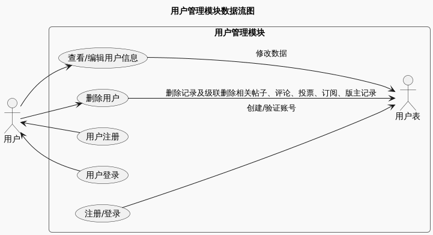
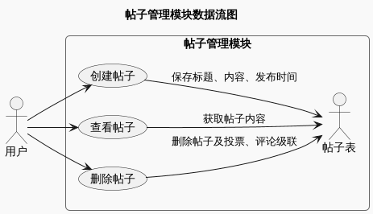
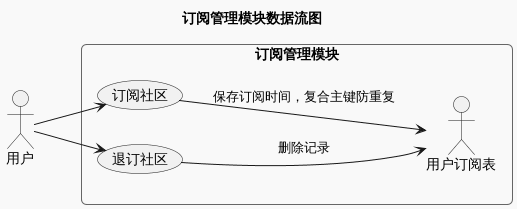
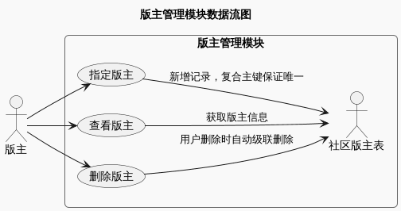
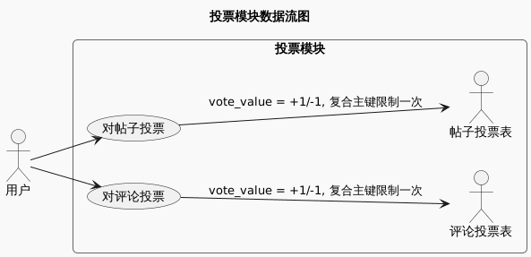
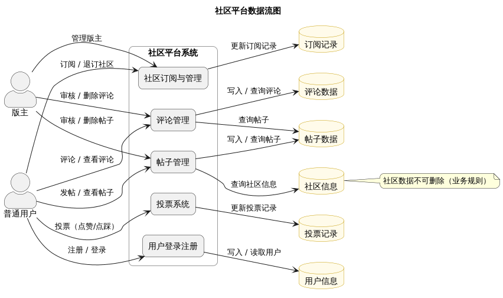
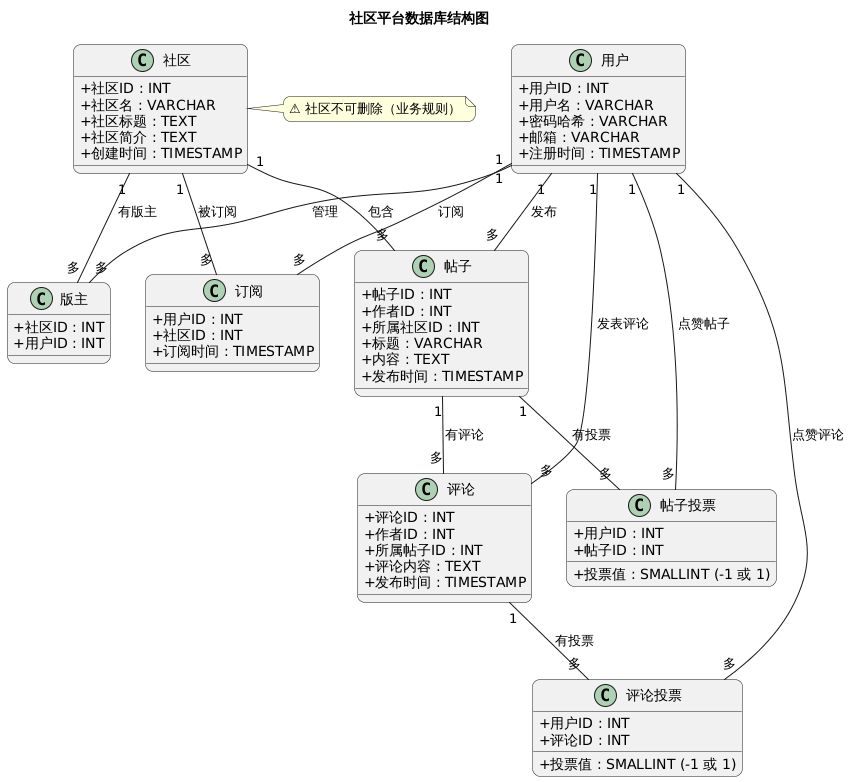

## 一、需求分析

### **1. 学习目的:**
   学习并理解一个社区平台数据库模型的设计，掌握以下技能：

- 理解关系型数据库建模，尤其是社区平台场景（类似 Reddit 或论坛）
- 学习如何处理用户、社区、帖子、评论、订阅、版主和投票等复杂关系
- 理解级联删除、复合主键、约束（如唯一性、CHECK）对数据完整性的影响
- 将数据库表与业务功能对应，形成清晰的数据流和模块视图

### **2. 功能模块及实现功能:**

**2.1 用户管理模块:**

- 用户注册与登录
- 用户信息管理（用户名、邮箱、密码哈希）
- 用户创建时间记录
- 用户删除时，相关帖子、评论、投票、订阅和版主记录自动级联删除

**2.2 社区管理模块:**

- 创建子社区
- 维护社区基本信息（名称、标题、描述）
- 社区不可删除
- 社区与帖子、订阅、版主关联
- 帖子管理模块
- 用户在社区中发布帖子
- 帖子记录标题、内容、发布时间
- 帖子属于某个社区
- 用户删除时，帖子的投票和评论自动删除

**2.3 评论管理模块:**

- 用户对帖子发表评论
- 评论记录内容和发布时间
- 评论属于某个帖子
- 用户删除时，评论及其投票自动删除

**2.4 订阅管理模块:**

- 用户订阅或退订社区
- 记录订阅时间
- 复合主键(user_id, community_id)防止重复订阅

**2.5 版主管理模块:**

- 指定社区的版主
- 复合主键(community_id, user_id)保证唯一性
- 用户删除时，版主记录级联删除

   **2.6 投票模块:**

- 用户可对帖子或评论投票
- vote_value 仅允许 +1 或 -1
- 每用户对每条帖子或评论只能投一次（复合主键）
- 用户删除时，投票记录级联删除

### **3. 数据:**
**(a) 数据项预览:**
**数据项列表:**

| 数据项编号 | 数据项名                  | 数据项含义  | 与其它数据项的关系                                                                                                                 | 存储结构         | 别名   |
|-------|-----------------------|--------|---------------------------------------------------------------------------------------------------------------------------|--------------|------|
| 1     | user_id               | 用户唯一ID | 主键，Post.user_id、ForumComment.user_id、Subscription.user_id、CommunityModerator.user_id、PostVote.user_id、CommentVote.user_id | INT          | 用户ID |
| 2     | username              | 用户名    | 唯一                                                                                                                        | VARCHAR(255) | 用户名  |
| 3     | password_hash         | 用户密码哈希 | 与账号安全相关                                                                                                                   | VARCHAR(255) | 密码哈希 |
| 4     | email                 | 用户邮箱   | 唯一                                                                                                                        | VARCHAR(255) | 邮箱   |
| 5     | created_at            | 注册时间   | 自动生成                                                                                                                      | TIMESTAMP    | 注册时间 |
| 6     | community_id          | 社区唯一ID | 主键，Post.community_id、Subscription.community_id、CommunityModerator.community_id                                            | INT          | 社区ID |
| 7     | community_name        | 社区名称   | 唯一                                                                                                                        | VARCHAR(255) | 社区名  |
| 8     | community_title       | 社区标题   | 可选                                                                                                                        | TEXT         | 社区标题 |
| 9     | community_description | 社区简介   | 描述社区信息                                                                                                                    | TEXT         | 社区简介 |
| 10    | created_at            | 创建时间   | 自动生成                                                                                                                      | TIMESTAMP    | 创建时间 |
| 11    | post_id               | 帖子唯一ID | 主键，ForumComment.post_id、PostVote.post_id                                                                                  | INT          | 帖子ID |
| 12    | user_id               | 作者ID   | 外键 -> ForumUser.user_id                                                                                                   | INT          | 作者ID |
| 13    | community_id          | 所属社区ID | 外键 -> Community.community_id                                                                                              | INT          | 社区ID |
| 14    | post_title            | 帖子标题   | 内容信息                                                                                                                      | VARCHAR(255) | 帖子标题 |
| 15    | post_content          | 帖子内容   | 内容信息                                                                                                                      | TEXT         | 帖子内容 |
| 16    | created_at            | 发布时间   | 自动生成                                                                                                                      | TIMESTAMP    | 发布时间 |
| 17    | comment_id            | 评论唯一ID | 主键，CommentVote.comment_id                                                                                                 | INT          | 评论ID |
| 18    | user_id               | 作者ID   | 外键 -> ForumUser.user_id                                                                                                   | INT          | 作者ID |
| 19    | post_id               | 所属帖子ID | 外键 -> Post.post_id                                                                                                        | INT          | 帖子ID |
| 20    | comment_content       | 评论内容   | 内容信息                                                                                                                      | TEXT         | 评论内容 |
| 21    | created_at            | 评论时间   | 自动生成                                                                                                                      | TIMESTAMP    | 评论时间 |
| 22    | user_id               | 用户ID   | 外键 -> ForumUser.user_id，复合主键                                                                                              | INT          | 用户ID |
| 23    | community_id          | 社区ID   | 外键 -> Community.community_id，复合主键                                                                                         | INT          | 社区ID |
| 24    | subscribed_at         | 订阅时间   | 自动生成                                                                                                                      | TIMESTAMP    | 订阅时间 |
| 25    | community_id          | 社区ID   | 外键 -> Community.community_id，复合主键                                                                                         | INT          | 社区ID |
| 26    | user_id               | 用户ID   | 外键 -> ForumUser.user_id，复合主键                                                                                              | INT          | 用户ID |
| 27    | user_id               | 用户ID   | 外键 -> ForumUser.user_id，复合主键                                                                                              | INT          | 用户ID |
| 28    | post_id               | 帖子ID   | 外键 -> Post.post_id，复合主键                                                                                                   | INT          | 帖子ID |
| 29    | vote_value            | 投票值    | -1 或 +1                                                                                                                   | SMALLINT     | 投票值  |
| 30    | user_id               | 用户ID   | 外键 -> ForumUser.user_id，复合主键                                                                                              | INT          | 用户ID |
| 31    | comment_id            | 评论ID   | 外键 -> ForumComment.comment_id，复合主键                                                                                        | INT          | 评论ID |
| 32    | vote_value            | 投票值    | -1 或 +1                                                                                                                   | SMALLINT     | 投票值  |

**(b)数据结构:**
数据结构列表

| 数据结构编号 | 数据结构名(来源表名)        | 数据结构含义（表别名中文） | 组成（表包含字段）                                                                        |
|--------|--------------------|---------------|----------------------------------------------------------------------------------|
| 1      | ForumUser          | 用户表           | user_id, username, password_hash, email, created_at                              |
| 2      | Community          | 社区表           | community_id, community_name, community_title, community_description, created_at |
| 3      | Post               | 帖子表           | post_id, user_id, community_id, post_title, post_content, created_at             |
| 4      | ForumComment       | 评论表           | comment_id, user_id, post_id, comment_content, created_at                        |
| 5      | Subscription       | 用户订阅表         | user_id, community_id, subscribed_at                                             |
| 6      | CommunityModerator | 社区版主表         | community_id, user_id                                                            |
| 7      | PostVote           | 帖子投票表         | user_id, post_id, vote_value                                                     |
| 8      | CommentVote        | 评论投票表         | user_id, comment_id, vote_value                                                  |

**(c)数据流图:**

数据流图

**(d)E-R图:**

E-R图
